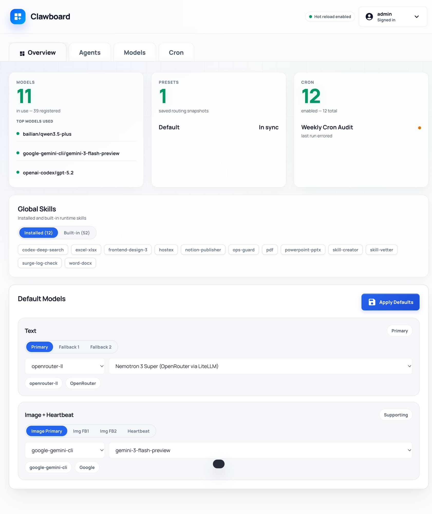
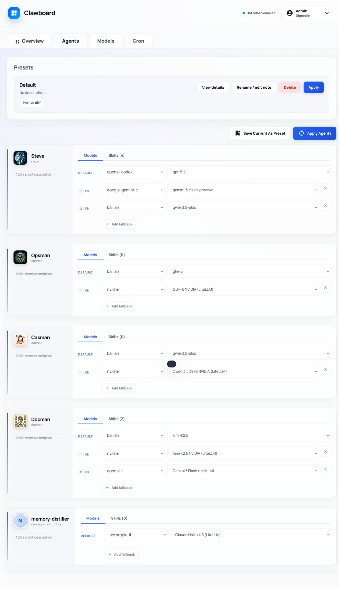
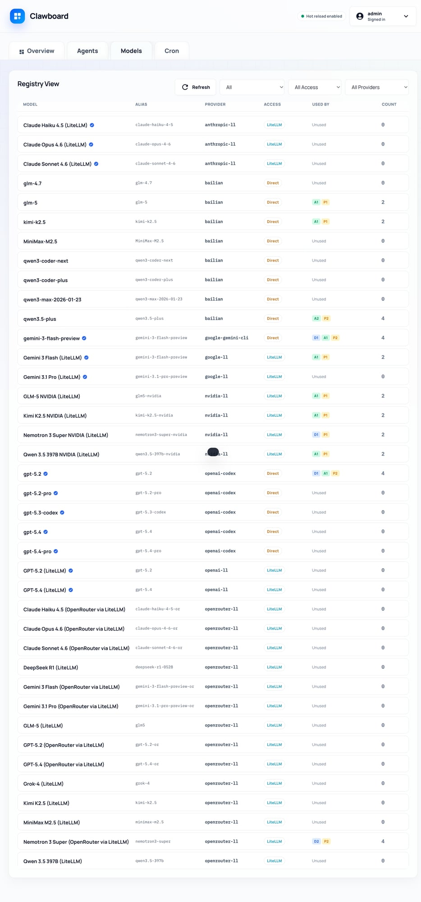
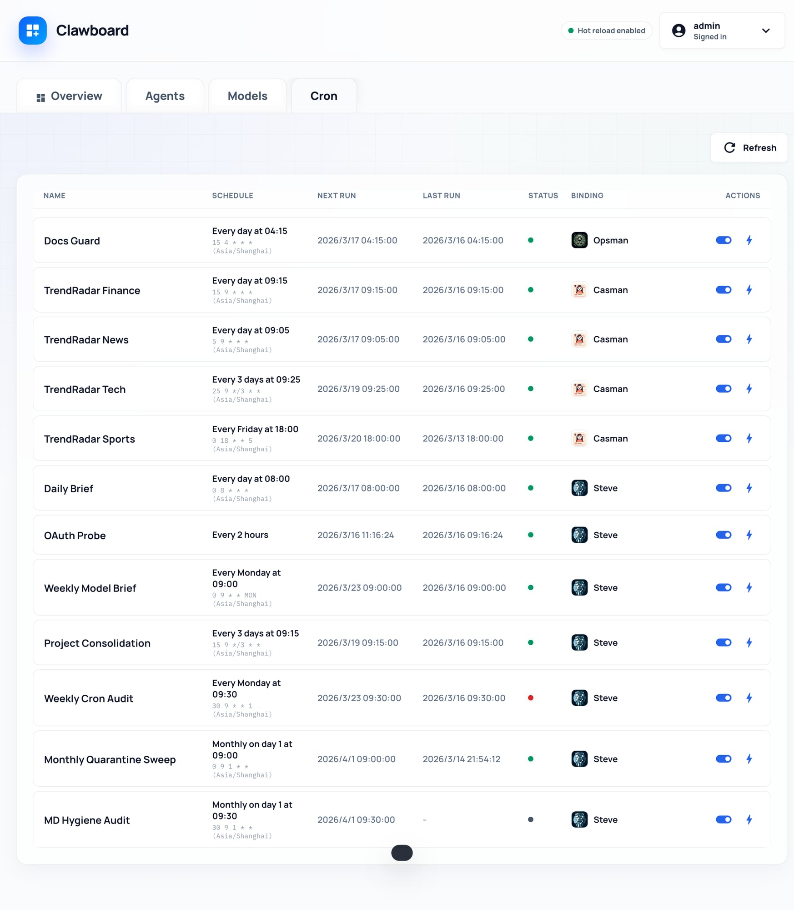

# Clawboard

A local control surface for OpenClaw.

Clawboard gives OpenClaw a compact web UI for:
- default model routing
- agent model configuration
- presets / routing snapshots
- model catalog visibility
- cron observability
- global skill visibility

## Status
Early but usable. Consider this an **alpha / v0.1** release.

## What it is
Clawboard is **not** a generic dashboard framework.
It is a companion UI for a local OpenClaw runtime.

That means:
- the repository contains the Clawboard application source code
- the app reads and writes runtime data from your local OpenClaw installation
- some features depend on your existing OpenClaw config, cron state, skills, and agent setup

## Screenshots

### Overview



### Agents



### Models



### Cron



## Features
- Local auth gate for the UI
- Overview for defaults, presets, cron, and global skills
- Agent routing controls with presets
- Models catalog with usage visibility
- Cron list with quick inspection / run / enable state
- Avatar upload and persistent storage
- Light / dark / auto theme

## Runtime model
Clawboard currently supports two working modes.

### 1. Default mode: build-time copy
The default `docker-compose.yml` builds an image and copies the project source into the image at build time.

This is better for:
- stable preview / deployment
- reproducible behavior
- sharing the project with others

Trade-off:
- changing source files does **not** immediately change the live app
- after code changes, you must rebuild/recreate the container

### 2. Development mode: live-mounted source
`docker-compose.dev.yml` mounts the source directory into the container and runs Node in watch mode.

This is better for:
- local UI iteration
- faster development loops

Trade-off:
- it is more development-oriented and less deployment-like

## Repo vs runtime data
### Source code (this repo)
Main source lives in this repository, for example:
- `server.js`
- `public/index.html`
- `Dockerfile`
- `docker-compose.yml`

### Runtime data (outside the repo)
Clawboard reads/writes real OpenClaw runtime data from `~/.openclaw`, including:
- `openclaw.json`
- cron jobs / runs
- presets
- local auth state
- avatar storage
- installed custom skills

Clawboard also reads built-in OpenClaw skills from the host installation when available.

## Optional integration: LiteLLM
Clawboard works without LiteLLM.

However, LiteLLM is recommended if you want:
- richer multi-provider model routing
- a broader aggregated model catalog
- cleaner provider switching behavior
- better visibility into LiteLLM-backed model references

## Default port
The default host port is:
- `3180`

So the local app is usually:
- `http://127.0.0.1:3180`

## Quick start
### First-time setup
Do this in order. Do **not** skip the `.env` step.

1. Copy the example env file:

```bash
cp .env.example .env
```

2. Edit `.env` for your machine.

At minimum, set:
- `OPENCLAW_HOME`
- `HOST_HOME`
- `OPENCLAW_BUILTIN_SKILLS_DIR`

3. Start Clawboard:

```bash
docker compose up -d --build
```

4. Open:

```text
http://127.0.0.1:3180
```

### Default credentials
On first run, Clawboard creates local UI credentials with the default login:

- username: `admin`
- password: `password`

**Change these immediately after first login.**

## Development mode
For live-mounted local development:

```bash
docker compose -f docker-compose.dev.yml up -d --build
```

## Important notes
- Do **not** preview this app with a static file server such as `python -m http.server`.
- Use the real app runtime so `/api/*` routes and login continue to work.
- If you use the default compose file, rebuild after source changes.

## Known issues / rough edges
- UI is still evolving; some views may still feel alpha.
- The project currently assumes a local OpenClaw runtime layout.
- Some experience depends on the shape of your existing OpenClaw config and skills.

## Roadmap
- better connectivity checks
- model usage / quota visibility
- further polish for schedule readability
- more refined global skill management

## License
MIT
